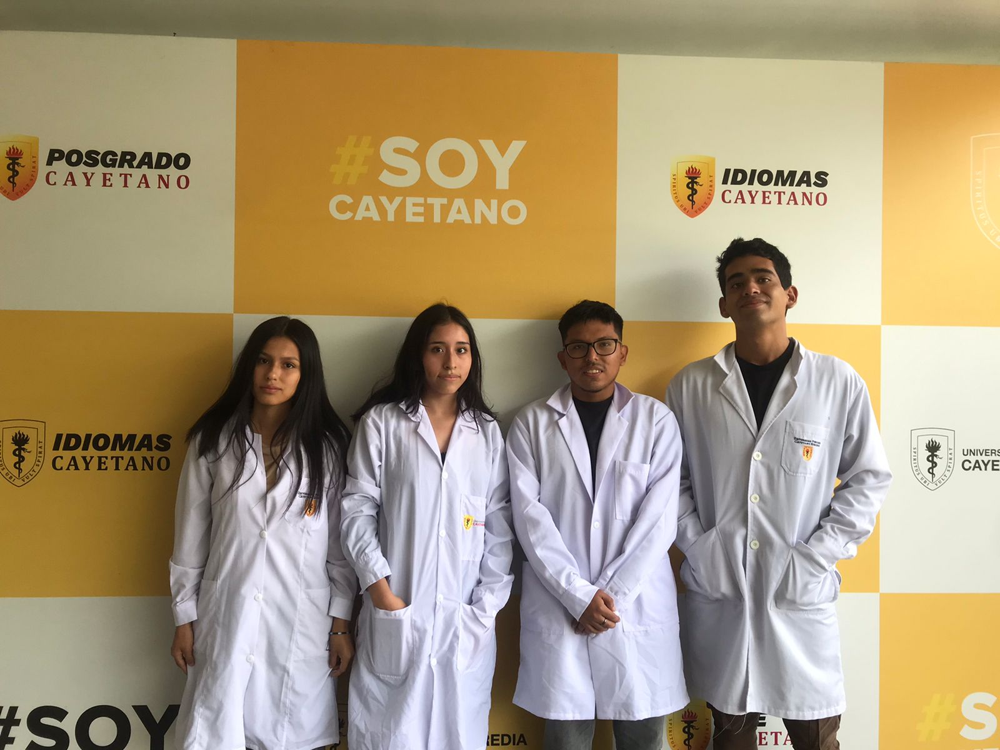

## UNIVERSIDAD PERUANA CAYETANO HEREDIA

 

# FUNDAMENTOS DE DISEÑO 🌱💻

## Tabla de Contenidos:
- [Introducción](#Introducción)
- [Integrantes y roles](#¿Quiénes-somos?)

## Introducción

*¡Bienvenidos a nuestro repositorio! Somos el Grupo 1 del curso de Fundamentos de Diseño 2024-1, y nos complace utilizar este repositorio para compartir y cargar el proyecto que estaremos desarrollando durante cada sesión a lo largo del curso. Estamos entusiasmados por contribuir al desarrollo sostenible de nuestro país y esperamos compartir nuestros avances y aprendizajes con ustedes.*

    

Objetivos de Desarrollo Sostenible, Fuente: ONU

## ¿Quiénes somos?
Nuestro equipo está conformado por: 

- Alarcon Arias, Julio Erick **(Coordinador Electrónico)**
- Atao Surichaqui, Ester Solamyt **(Coordinadora de Investigación y Redacción)**
- Gavidia Crovetto, Bruno Paolo **(Coordinador General y Software)**
- Vega Pahuara, Millene Nadile **(Coordinadora del Prototipado)**

Si deseas conocer más sobre nosotros, te invitamos a entrar a este [link:](https://github.com/BrunoXIII-Gav/FDD_1/blob/main/Fundamentos_de_Dise%C3%B1o/Entregables/Sobre_nuestro_grupo.md)

    

## ODS 13: ACCIÓN POR EL CLIMA

El ODS 13 es: "Adoptar medidas urgentes para combatir el cambio climático y sus efectos" cuyo objetivo es prepararnos para afrontar los impactos del cambio climático, sentar las bases de una economía neutra en emisiones y acompañar a los colectivos más vulnerables en el proceso de transición. Involucrando a todas las administraciones y a todos los actores de la sociedad civil y del mundo académico y científico. El Objetivo tiene metas que deben alcanzarse para 2030. El progreso hacia las metas se medirá mediante indicadores.

# ¿POR QUÉ LA ELEGIMOS?

Escogimos La ODS número 13 porque observamos que el cambio climático está provocando fenómenos climáticos extremos como sequías, inundaciones, y aumento de la temperatura. En Perú, esto puede manifestarse en la disminución de las reservas de agua debido al retroceso de los glaciares en la Cordillera de los Andes, lo que afecta la disponibilidad de agua para consumo humano, agricultura y generación de energía hidroeléctrica. También, el aumento de la temperatura y la urbanización pueden contribuir a la contaminación del aire en ciudades como Lima, afectando la salud de la población y exacerbando problemas respiratorios. Además, la contaminación atmosférica puede tener efectos negativos en la calidad de los recursos naturales.

# OBJETIVO GENERAL:

Diseñar e implementar un proyecto de mitigación y adaptación al cambio climático en una comunidad vulnerable de nuestra región, centrándonos en la reducción de pérdidas ocasionadas por eventos climáticos extremos.

OBJETIVOS ESPECIFICOS:

Incorporar medidas relativas al cambio climático en las políticas, estrategias y planes nacionales.

REFERENCIAS BIBLIOGRAFICAS
